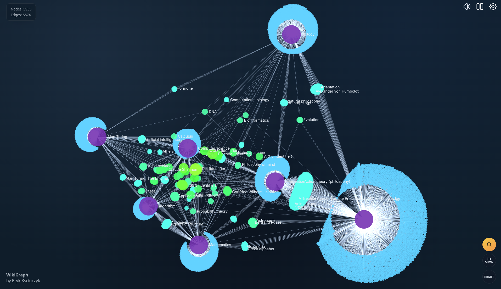
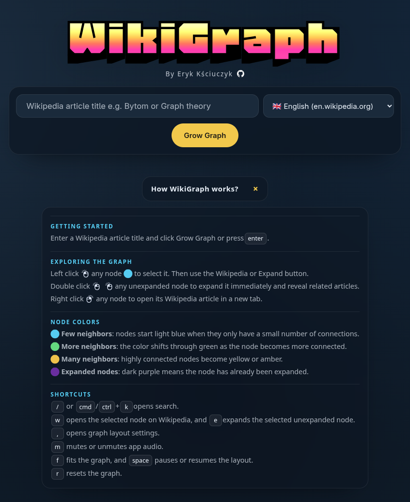
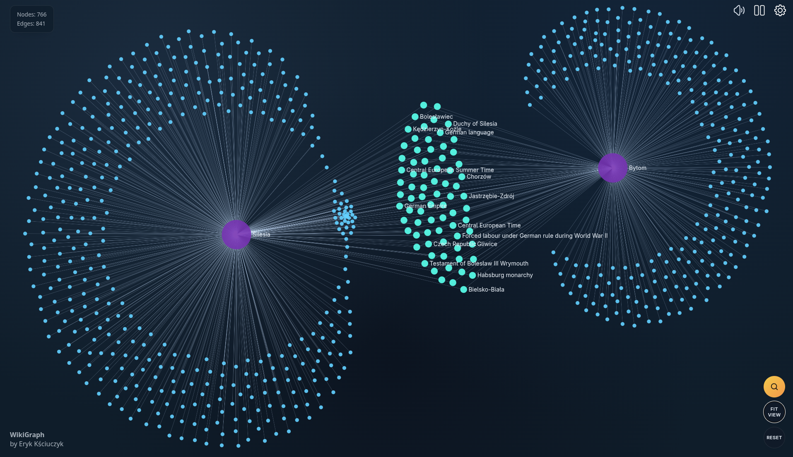

# WikiGraph

Interactive Wikipedia graph explorer built with React and TypeScript.
Start from any article, expand outward through linked pages, and follow how topics connect across Wikipedia.



WikiGraph turns Wikipedia into a visual space for discovery.
It started as an attempt to build an Obsidian-style graph for Wikipedia.
Use it to uncover surprising paths between two topics.
Use it to explore the intersections between different fields, ideas, and domains.
What looks unrelated at first can reveal a chain of shared concepts after only a few expansions.

https://github.com/user-attachments/assets/84b684a9-3b8d-486d-a8b7-f628e37bd426

## What it does

WikiGraph turns Wikipedia from a list of articles into a map of connected ideas.

- Start from any Wikipedia article title
- Expand nodes to reveal linked topics and related pages
- Open the selected article on Wikipedia in one click
- Search with live title suggestions as you type
- Switch between multiple Wikipedia language editions
- Tune the graph layout while you explore
- Discover hidden or unexpected connections between distant topics
- Explore where different fields and subjects overlap

## Why use it

WikiGraph is useful when you want to browse Wikipedia with more context than a single article can provide.
It makes it easier to spot clusters, bridges, and hubs inside a topic area.
It also helps surface the connective tissue between disciplines such as mathematics, history, philosophy, technology, science, and art.

## Screenshots

| Splash                                           | Instructions                                          |
| ------------------------------------------------ | ----------------------------------------------------- |
|  |  |

| Graph view                                   | Expanded graph                                 |
| -------------------------------------------- | ---------------------------------------------- |
|  |  |

## Tech stack

- React 19
- TypeScript
- Vite
- Sigma.js for graph rendering
- Graphology for graph data structures
- ForceAtlas2 for layout simulation
- Zustand for app state
- Wikipedia API for article expansion and search suggestions

## How it works

Enter a Wikipedia article title, choose a language, and grow the graph from that seed page.
WikiGraph resolves the article, fetches its linked pages from Wikipedia, and turns those relationships into an interactive graph you can expand, inspect, and navigate.

## Development

```bash
npm install
npm run dev
```

Available scripts:

```bash
npm run dev
npm run build
npm run lint
npm run format
npm run preview
```

## Build

```bash
npm run build
```

## Docker

Build a production image with the included `Dockerfile`.

```bash
docker build -t wikigraph .
```
